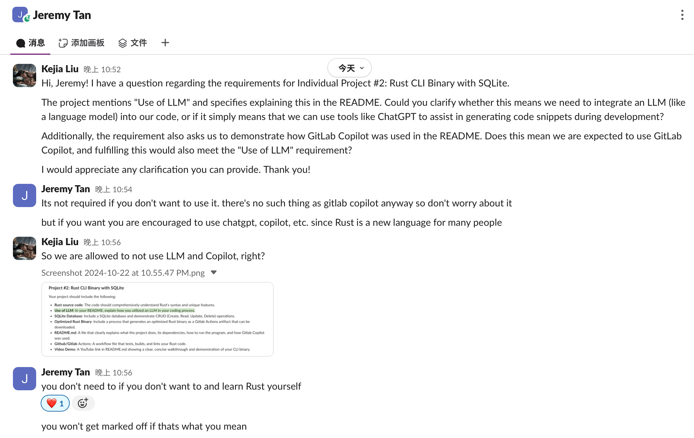

# IDS706 Rust CLI Binary Interacting with SQLite Database

## Continuous Integration with GitHub Actions
[](https://github.com/Reby0217/ids706-indvidual2/actions/workflows/format.yml)
[](https://github.com/Reby0217/ids706-indvidual2/actions/workflows/lint.yml)
[](https://github.com/Reby0217/ids706-indvidual2/actions/workflows/build.yml)
[](https://github.com/Reby0217/ids706-indvidual2/actions/workflows/test.yml)

## Video Demo
[Youtube Video Here](https://youtu.be/Q4x5VDLmvY4) 

## Description
This project focuses on building a Rust CLI Binary that interacts with an SQLite database, demonstrating CRUD operations (Create, Read, Update, Delete). The binary is optimized and automatically built using GitHub Actions, and artifacts can be downloaded after the CI/CD pipeline completes successfully.

---

## Project Structure
```bash
.
├── src
│   ├── lib.rs                         # Contains the core logic for CRUD operations on the SQLite database
│   ├── main.rs                        # Entry point for the Rust CLI binary
├── tests
│   ├── test.rs                        # Unit tests for CRUD operations in Rust
├── Makefile                           # Commands for build, test, lint, and format
├── wealth_db.db                       # SQLite database used for the project
├── Cargo.toml                         # Project dependencies and metadata
└── .github/workflows                  # CI/CD workflows for GitHub Actions
```

---

## Dependencies

To run this project, you need to have the following dependencies installed:

1. **Rust and Cargo**: 
   - Install Rust and Cargo with the following command:
     ```bash
     curl --proto '=https' --tlsv1.2 -sSf https://sh.rustup.rs | sh
     ```

2. **SQLite**: The project uses the SQLite database. Ensure that SQLite is installed on your system if you plan to interact directly with the database files.

3. **Make**: The project uses a `Makefile` to manage common tasks like formatting, linting, testing, and building the project.

4. **Rusqlite Crate**: Rust crate for interacting with SQLite databases. This is handled automatically by Cargo through `Cargo.toml`.

Verify that Rust and Cargo are installed:
```bash
rustc --version   # Rust compiler version
cargo --version   # Cargo package manager version
```

---

## How to Run

1. **Clone the repository**:

   Clone the project repository and navigate into the project directory:

   ```bash
   git clone https://github.com/Reby0217/ids706-indvidual2.git
   cd ids706-indvidual2
   ```

2. **Install dependencies and set up the toolchain**:

   The `make install` command installs the required Rust toolchain components (`rustfmt` and `clippy`):
   
   ```bash
   make install
   ```

3. **Build, format, lint, and test the binary**:

   To ensure your code is clean, follows best practices, and compiles correctly, use the `make all` command. This will automatically format, lint, build, and run tests on the project in one step:

   ```bash
   make all  # Runs format, lint, build, and tests
   ```

4. **Run unit tests**:

   You can use the `make test` command to run the unit tests, ensuring the correctness of the CRUD operations:

   ```bash
   make test  # Run all unit tests
   ```

   Successful test execution:
   

5. **Run the binary**:

   After building the project, you can run the binary:

   - For development (debug mode):
     ```bash
     make run  # Build and run the binary in debug mode
     ```

   - For release (optimized binary):
     ```bash
     target/release/ids706-indvidual2
     ```
---


## Deliverables
- **Rust CLI Binary**: The main binary (`ids706-indvidual2`) performs CRUD operations on a database of the wealthiest individuals.
- **SQLite Database**: Includes an SQLite database (`wealth_db.db`) for demonstration. Below is a snapshot of the table after the CRUD operations have been executed, showing the remaining records:


- **Screenshot of successful database operations**: 


- **Use of LLM and GitLab Copilot**: For this project, we chose not to utilize an LLM or GitLab Copilot during the development process. After consulting with the TA, we confirmed that the use of these tools is entirely optional, and not using them will not result in any loss of points. We decided to approach the project by learning and implementing Rust independently, relying on personal research and development.


- **Optimized Rust Binary**:  
  The project includes an optimized Rust binary (`ids706-indvidual2`) built using the `cargo build --release` command. This binary is designed for efficient performance and demonstrates CRUD (Create, Read, Update, Delete) operations on an SQLite database. The binary is built and packaged automatically through GitHub Actions as an artifact that can be downloaded directly from the repository.


---

### SQLite Database

This project connects to a SQLite database (`wealth_db.db`) and performs various operations on it, including creating tables, inserting, updating, reading, and deleting records. The connection is established using the `rusqlite` crate.

---

### CRUD Operations

1. **Create**: Inserts records for the wealthiest individuals into the database.
   ```rust
   conn.execute(
       "INSERT INTO wealthiest_people (id, name, country, industry, net_worth, company) VALUES (?1, ?2, ?3, ?4, ?5, ?6)",
       params![person.0, person.1, person.2, person.3, person.4, person.5],
   )?;
   ```

2. **Read**: Retrieves records from the database, sorted by `net_worth` or filtered by `industry`.
   - **All Records**:
     ```sql
     SELECT * FROM wealthiest_people;
     ```

   - **Sort by Net Worth**:
     ```sql
     SELECT * FROM wealthiest_people ORDER BY net_worth DESC;
     ```

   - **Filter by Industry**:
     ```sql
     SELECT * FROM wealthiest_people WHERE industry = 'Tech';
     ```

3. **Update**: Updates the net worth of specific individuals.
   ```rust
   conn.execute(
       "UPDATE wealthiest_people SET net_worth = 180 WHERE name = 'Charlie'",
       params![],
   )?;
   ```

4. **Delete**: Deletes bob's records from the database.
   ```rust
   conn.execute("DELETE FROM wealthiest_people WHERE name = 'Bob'", params![])?;
   ```

---

## Makefile

The project uses a `Makefile` to streamline development tasks, including version checks, testing, formatting, linting, and building. Below are the key commands available in the `Makefile`:

- **Rust Version**: Display the versions of the Rust toolchain components (compiler, package manager, formatter, linter).
  ```bash
  make rust-version
  ```

- **Format**: Format all Rust files using `rustfmt` to ensure consistent code style.
  ```bash
  make format
  ```

- **Lint**: Run `clippy` to analyze the Rust code for common mistakes and best practices.
  ```bash
  make lint
  ```

- **Test**: Run unit tests for the project using `cargo test`. It specifically targets tests located in the `tests/test.rs` file.
  ```bash
  make test
  ```

- **Build**: Compile the project in debug mode.
  ```bash
  make build
  ```

- **Run**: Build the project and then execute the compiled binary.
  ```bash
  make run
  ```

- **Release**: Build an optimized release version of the binary.
  ```bash
  make release
  ```

- **All**: Perform a full suite of tasks—format, lint, build, test, and run the project.
  ```bash
  make all
  ```
